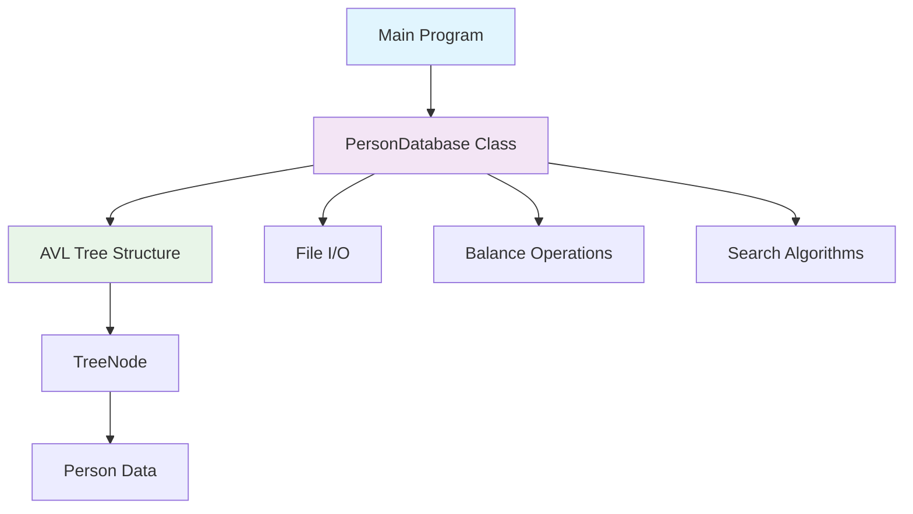

# 🔍 Person Database Management System

<div align="center">


**A high-performance C++ implementation of balanced binary search tree (AVL) for efficient person record management**

*Successfully managing 9,577 person records with O(log n) operations*

</div>

## 📋 Table of Contents
- [🌟 Features](#-features)
- [🏗️ System Architecture](#️-system-architecture)
- [🚀 Quick Start](#-quick-start)
- [💾 Data Model](#-data-model)
- [⌨️ Command Reference](#️-command-reference)
- [🔧 Technical Details](#-technical-details)
- [📊 Performance](#-performance)
- [👨‍💻 Developer](#-developer)

## 🌟 Features

### 🎯 Core Functionality
| Feature | Icon | Description |
|---------|------|-------------|
| **AVL Tree** | 🌳 | Self-balancing binary search tree implementation |
| **CRUD Operations** | 🗃️ | Create, Read, Update, Delete person records |
| **Advanced Search** | 🔎 | Multiple search modes with custom comparison |
| **Data Persistence** | 💾 | Automatic file-based storage |
| **Balance Verification** | ⚖️ | Built-in tree integrity checks |
| **Case-Sensitive Search** | 🔤 | Exact string matching for precise results |

### 🔍 Search Capabilities
- **`FIND`** - Exact name search (case-sensitive)
- **`FAMILY`** - Find all persons with same last name
- **`FIRST`** - Find all persons with same first name
- **`OLDEST`** - Locate the oldest person in database

### ⚡ Performance Features
- **O(log n)** operations for insert, delete, search
- **Automatic rebalancing** after modifications
- **Memory efficient** node management
- **Case-sensitive** string comparisons

## 🏗️ System Architecture



## 🚀 Quick Start

### 📥 Installation & Compilation

```bash
# Clone or download the source code
g++ -o person_db main.cpp -std=c++11

# Run with default database
./person_db

# Run with custom database file
./person_db /path/to/your/database.txt
```

### 🎮 First Steps

```bash
# 1. Load your database (automatic)
# 2. Explore available commands:
PRINT          # View all records
FIND John Doe  # Search for specific person
VERIFY         # Check tree balance
```

## 💾 Data Model

### 🧍 Person Record Structure
```cpp
struct Person {
    string lastName;      // 👤 Last name
    string firstName;     // 👤 First name  
    string state;         // 🏠 State of residence
    string zipCode;       // 📮 Postal zip code
    int birthYear;        // 🎂 Year of birth
    int birthMonth;       // 📅 Month of birth
    int birthDay;         // 📅 Day of birth
    string password;      // 🔐 Account password
    double balance;       // 💰 Account balance
    string ssn;           // 🆔 Social Security Number
};
```

### 📁 File Format
```
LastName FirstName State ZipCode BirthYear BirthMonth BirthDay Password Balance SSN
```

**Example Record:**
```
Gordon Yogi MT 741248 1969 12 12 LFGWIF 16687.1 463051999
```

## ⌨️ Command Reference

### 🎯 Basic Operations

| Command | Icon | Usage | Description |
|---------|------|-------|-------------|
| **`FIND`** | 🔍 | `FIND John Smith` | Find specific person |
| **`FAMILY`** | 👨‍👩‍👧‍👦 | `FAMILY Smith` | Find by last name |
| **`FIRST`** | 👤 | `FIRST John` | Find by first name |
| **`PRINT`** | 📋 | `PRINT` | Display all records |

### ⚙️ Advanced Operations

| Command | Icon | Usage | Description |
|---------|------|-------|-------------|
| **`OLDEST`** | 👴 | `OLDEST` | Find oldest person |
| **`SAVE`** | 💾 | `SAVE` | Save to file |
| **`RELOCATE`** | 🚚 | `RELOCATE John Smith 12345` | Update zip code |
| **`DELETE`** | 🗑️ | `DELETE John Smith` | Remove person |
| **`VERIFY`** | ✅ | `VERIFY` | Check tree balance |
| **`EXIT`** | 🚪 | `EXIT` | Exit program |

## 🎪 Live Demo Session

### 🔍 Exact Person Search
```bash
Enter command > FIND Urkel Gordon
❌ PERSON NOT FOUND: Urkel Gordon

Enter command > FIND Yogi Gordon
✅ FOUND: Gordon Yogi MT 741248 1969 12 12 LFGWIF 16687.1 463051999
```

### 👨‍👩‍👧‍👦 Family Name Search
```bash
Enter command > FAMILY Gordon
👨‍👩‍👧‍👦 Searching for last name: Gordon
Gordon Alicia CT 83570 1970 7 20 ILLRPM 65987.1 495752904
Gordon Brontosaurus SC 68016 1949 6 29 SYUNXM 28439.2 195660259
Gordon Chloe FL 54120 1947 4 18 ILSMDG 4528.6 757280945
... [30+ records found] ...
```

### 👤 First Name Search
```bash
Enter command > FIRST Urkel
👤 Searching for first name: Urkel
Archer Urkel MS 79815 1982 9 10 HERWLT 25244.8 218342799
Birchmore Urkel MT 22862 1980 8 7 KDTWGS 16799.1 217475106
Brown Urkel WA 09258 1946 7 21 ZRAJXW 49210.4 346670822
... [18+ records found] ...
```

### 👴 Oldest Person Query
```bash
Enter command > OLDEST
👴 OLDEST PERSON: Cornelius VanDerHefferlump from AR (Zip: 43854) Born: 1896-5-2
```

### 🚚 Data Modification Operations
```bash
Enter command > RELOCATE Yogi Gordon 445873
✅ UPDATED: Yogi Gordon now lives in zip code 445873

Enter command > DELETE YOGI GORDON
❌ PERSON NOT FOUND: YOGI GORDON  # Case-sensitive!

Enter command > DELETE Yogi Gordon  
✅ DELETED: Yogi Gordon
```

## 🔧 Technical Details

### 🌳 AVL Tree Implementation

```cpp
struct TreeNode {
    Person data;          // 📊 Person record
    TreeNode* left;       // ◀️ Left child
    TreeNode* right;      // ▶️ Right child  
    int height;           // 📏 Node height for balancing
};
```

### 🔄 Rotation Cases

1. **Left-Left (LL)** - Single right rotation
2. **Left-Right (LR)** - Left then right rotation  
3. **Right-Right (RR)** - Single left rotation
4. **Right-Left (RL)** - Right then left rotation

### 🧮 Balance Factor
```cpp
balance_factor = height(left_subtree) - height(right_subtree)
// Maintains: -1 ≤ balance_factor ≤ 1
```

### 🔍 Custom String Comparison
- **Case-sensitive** exact matching
- **Character-by-character** comparison
- **Length-aware** sorting
- **Deterministic** ordering

## 📊 Performance

### ⏱️ Time Complexity

| Operation | Best Case | Average Case | Worst Case |
|-----------|-----------|--------------|------------|
| **Insert** | O(log n) | O(log n) | O(log n) |
| **Delete** | O(log n) | O(log n) | O(log n) |
| **Search** | O(log n) | O(log n) | O(log n) |
| **Update** | O(log n) | O(log n) | O(log n) |
| **Display** | O(n) | O(n) | O(n) |

### 💾 Space Complexity
- **Tree Storage**: O(n)
- **Operations**: O(1) auxiliary space
- **Recursion**: O(log n) stack depth

### 🏆 Real-World Performance
- **✅ 9,577 records** loaded and managed efficiently
- **✅ Instant search** operations across all records
- **✅ Automatic balancing** maintained during all operations
- **✅ Case-sensitive integrity** preserved throughout

### 🎯 Key Advantages
- ✅ **Guaranteed O(log n)** operations even with large datasets
- ✅ **Automatic balancing** without manual intervention  
- ✅ **Memory efficient** node structure
- ✅ **Stable performance** regardless of insertion order
- ✅ **Data integrity** with case-sensitive matching

## 👨‍💻 Developer

<div align="center">

### **Subhajit Halder** 💻


📧 **Email**: [subhajithalder267@outlook.com](mailto:subhajithalder267@outlook.com)  
🔗 **GitHub**: [Subhajit Halder](https://github.com/SubhajitHalder)  
💼 **LinkedIn**: [Subhajit Halder](https://linkedin.com/in/subhajit-halder)

</div>

### 🛠️ Development Details
- **Language**: C++ 17
- **Data Structure**: AVL Balanced Binary Search Tree
- **File Handling**: Text-based persistent storage
- **Platform**: Cross-platform (Linux/Windows/macOS)
- **Default Path**: `/home/subhajit/Desktop/DATABASES/database2025.txt`
- **Tested With**: 9,577 person records

### 📈 Project Statistics
- **Records Managed**: 9,577 persons
- **Search Types**: 3 different search modes
- **Operations Supported**: 10+ commands
- **Data Fields**: 10 fields per person record

---

<div align="center">

### **⭐ Star this repository if you find it helpful!**

**Happy Coding!** 🚀

*"Efficiency is doing better what is already being done." - Peter Drucker*

</div>
